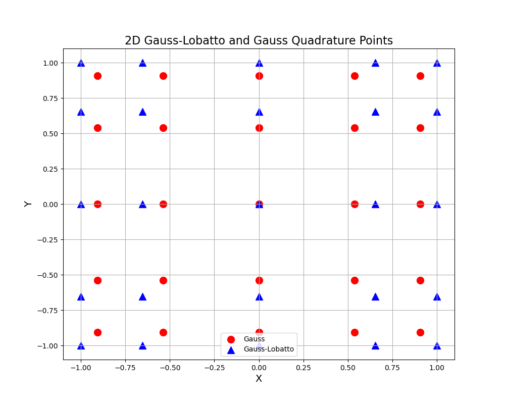
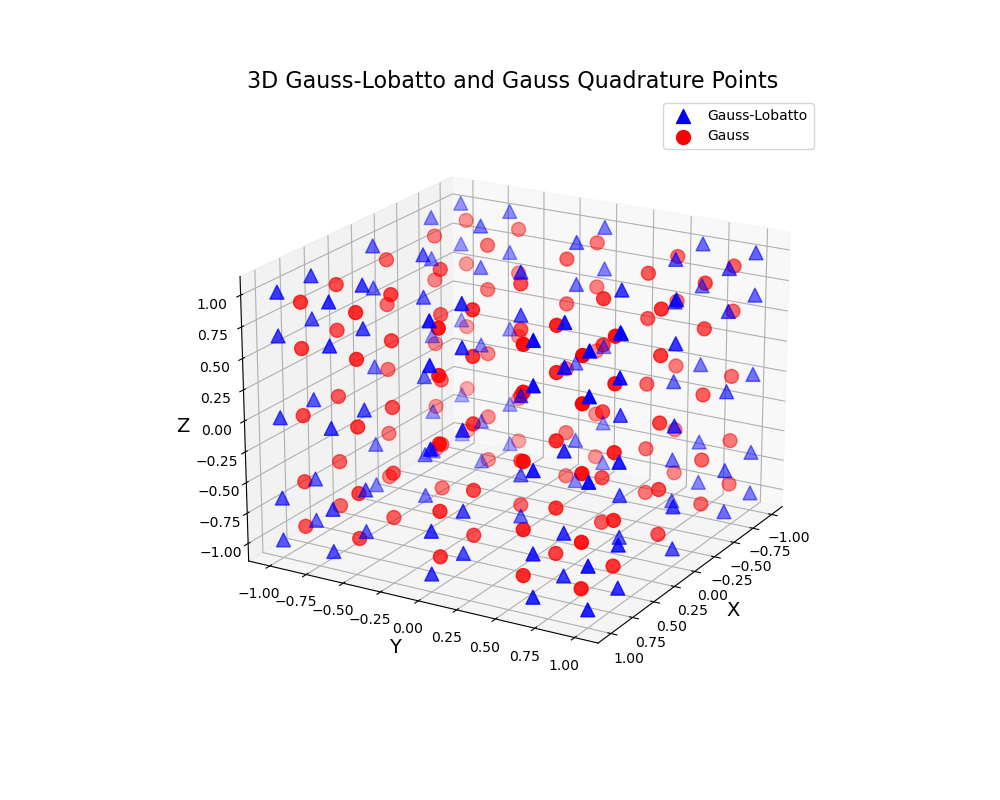
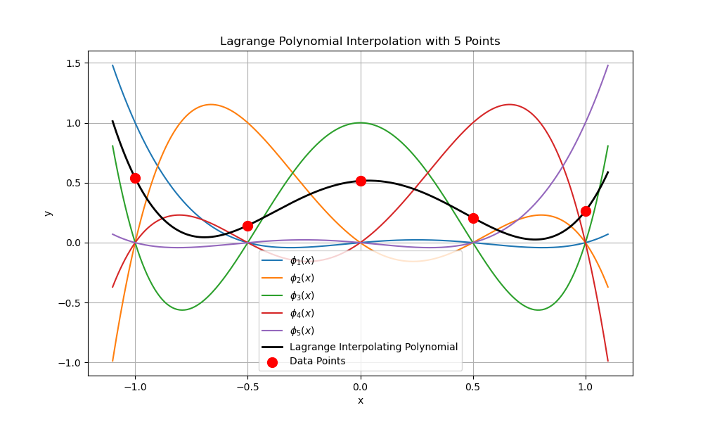

# Quadrature Points Mapping in 2D and 3D + Legendre polynomials in 1D
THIS REPOSITORY IS FOR LEARNING THE DG SCHEME.

This repository contains Python scripts to generate and visualize Gauss and Gauss-Lobatto quadrature points in 2D and 3D. Quadrature points are used in numerical integration to approximate the integral of functions.
Comparison of the quadrature points in 2D can be done with comparison_of_quad_points_in2d.py. You'll get the following image.

In addition, you can compare those quadrature points in 3D with comparison_of_quadrature_points.py. You'll get the following image.


In this repository, you can find some codes to describe lagrange polynomials defined on [-1,1].

## Introduction
The scripts in this repository provide functions to calculate Gauss and Gauss-Lobatto quadrature points and weights. Additionally, the scripts include visualization tools to plot these points in both 2D and 3D spaces.

## Requirements
- Python 3.x
- NumPy
- Matplotlib

You can run those code with:
```sh
python *.py